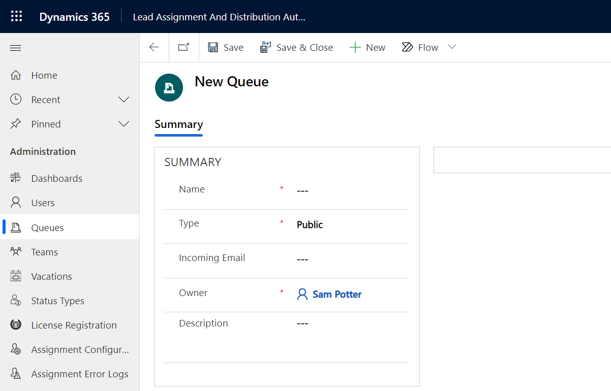

# Set up Queue

Once the members are added to the teams, next step is to set up Queues. It is necessary to add members to Queue in order to assign Leads to the respective users. If you have existing private queues then use that or create new queues. Follow the steps given below to create a new queue:

### For Online

* Navigate to **Lead Assignment and Distribution Automation App --> Administration --> Queues --> Click on ‘New’.**

*   Enter details into respective fields and click on **‘Save’**.&#x20;

    * **Name:** Give name to the Queue. For e.g. **Lead**&#x20;
    * **Type:** Select **‘Private’**, as by default it is set as ‘Public’.&#x20;
    * **Description:** Provide description, for e.g. **Lead from website.**

    Once it is saved, you can add members to the **Queue**.


**Note: You can only use one particular queue for a respective assignment rule.**


###

### For On-Premises

* Navigate to **Settings --> Lead Assignment Distribution --> Queues --> Click on ‘New’.**

.png>)

*   Enter details into respective fields and click on **‘Save’**.&#x20;

    * **Name:** Give name to the Queue.
    * **Type:** Select **‘Private’**, as by default it is set as ‘Public’.&#x20;
    * **Description:** Provide description.

    Once it is saved, you can add members to the **Queue**.

.png>)
