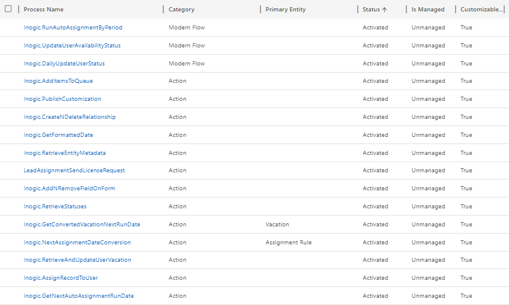

# FAQs

## 1) After importing the solution of Lead Assignment and Distribution Automation from website all the Processes of Lead Assignment and Distribution Automation is in a 'Draft/Deactivated' state. What to do?

Once the solution is imported, please follow the below steps to activate all the processes of Lead Assignment and Distribution Automation.

* Click on the **gear icon** --> Select **Advanced Settings**.&#x20;

* Next, select **Processes**.

* From **'All Process'** View activate the process shown in the below screenshot:

## 2) We have done a sandbox copy of the production environment to a TEST environment and would like to work with 'Lead Assignment and Distribution Automation' solution in this new instance. What should we do?

For this, you need to delete the **Inogic License Details** record from your sandbox environment. After deleting, the next step would be to [activate the license.](https://docs.inogic.com/lead-assignment-and-distribution-automation/getting-started/license-activation)

To delete the **Lead Assignment and Distribution Automation** license follow the steps given below:

* Navigate to **Advanced Find.**

.png>)

* Select **Inogic License Details** in **‘Look for’** --> Click on **Results** button.

.png>)

* Select the **Lead Assignment and Distribution Automation** record and **delete** it.

## 3) What are the steps to remove user from Assignment Process and re-add them again?

If you want to remove user from the Assignment process, then you will need to remove the user from the queue (that you added in the Assignment Rule record). When you remove the user from queue, the user workload record of that user automatically gets deleted, and records will no longer be assigned to that user.

Later, when you want to assign records to the same user, then you will simply need to re-add the user in the same queue. This will create the user workload record for that user, and records will start getting assigned to that user.


**Note: You don’t have to delete/deactivate the user workload record.**


Another alternative is to use the [**'User Availability'** ](https://docs.inogic.com/lead-assignment-and-distribution-automation/configuration/set-up-user-availability)feature for the same.

## 4) On creation of Assignment Rule record the 'User Workload' records were not created. What is the reason for this?

There can be few reasons because of which **'User Workload'** is not created. So, please ensure to match all the criteria stated below:

* There are users in the queue that has been selected in the Assignment Rule record&#x20;
* The users have either Lead Assignment User or Administrator security role&#x20;
* The users are part of the Lead Assignment And Distribution Automation Team&#x20;
* The license is active and user count has not exceeded the limit

## 5) The records are added to the queue but they are not being assigned to the user. What could be the reason for this?

Please ensure that the user who is creating records has the privilege of 'Assigning' records for that particular entity. Without the 'Assign' privilege the records will be not be assigned to the user. Further, check whether the user's capacity or the Max Work Items have reached their limit or not and also, if **Consider Availability** is **Yes** for that rule, then please check if the user is Available or not.

## 6) Is Lead Assignment and Distribution Automation available for on-premise environment?

Yes, it is available for On-premise environment with 9.x version.

## 7) After installing the new solution in On-premise environment there is difficulty in updating any of the Capacity and Queue details via App. But the same changes can be done in Classic UI. Why?

This is because of the limitation from Microsoft for On-premise instances. Users can make changes in OOB entities only from Classic UI and not through App.

## 8) What does the following error log mean- **“The real-time workflow named "Inogic.AddItemsToQueue" failed with the error "CallAssignRecordAction:The real-time workflow named "Inogic.AssignRecordToUser" failed with the error "AssignToUser : You are not allowed to pick this item.""”**

This log gets generated when the record is already been picked by some other user or if there is any custom process that also assigns the record along with our Lead assignment process**.**
