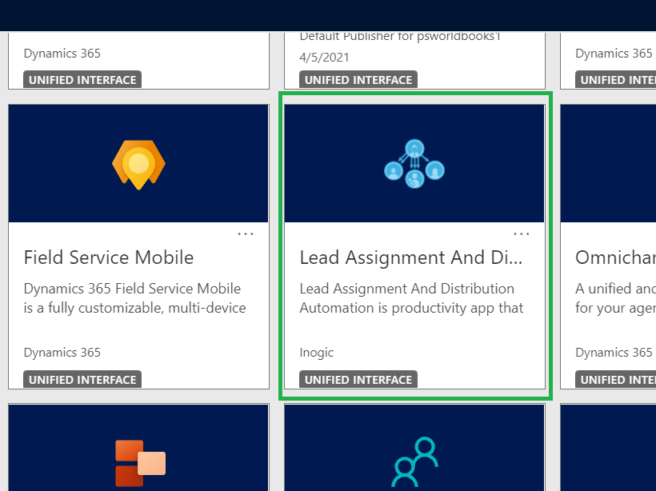
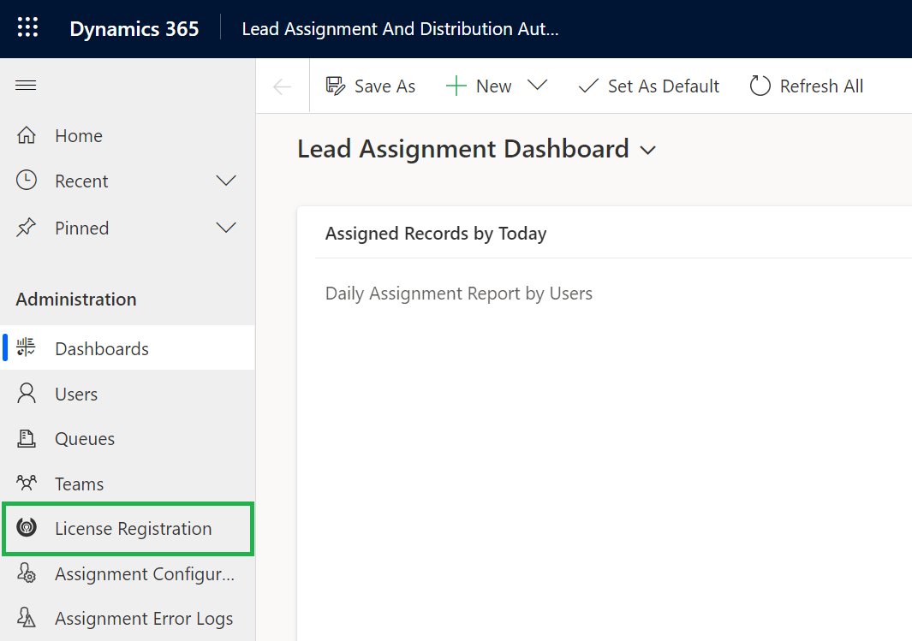
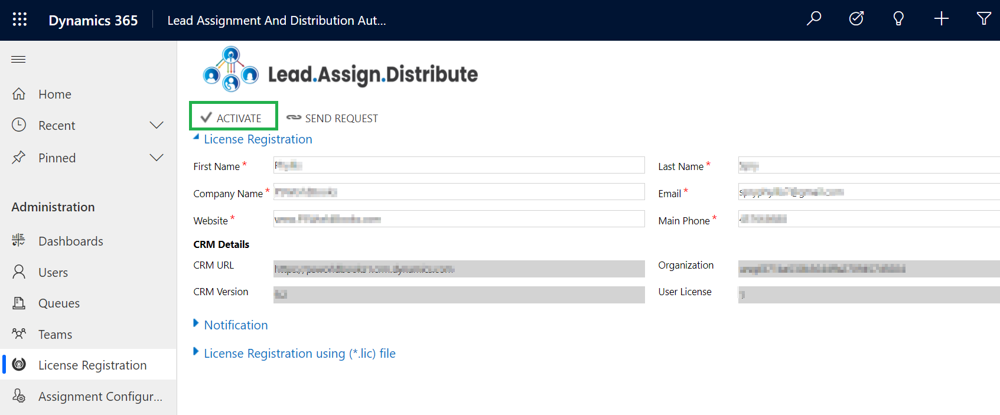
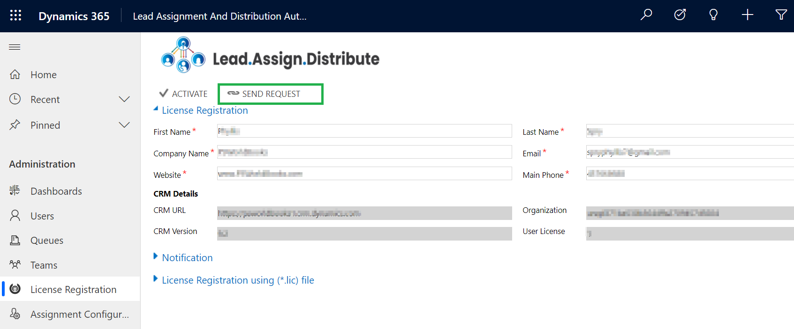
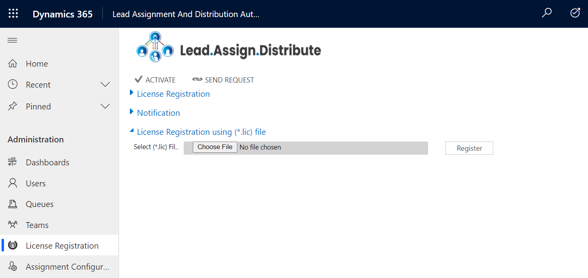
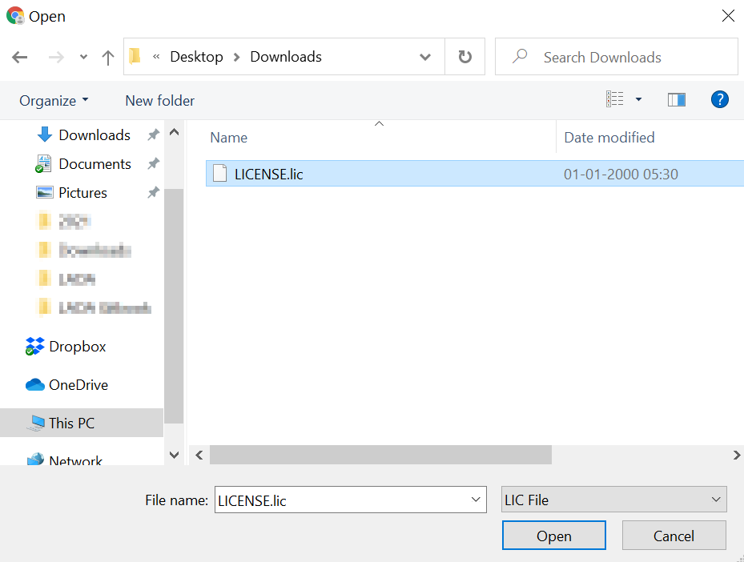
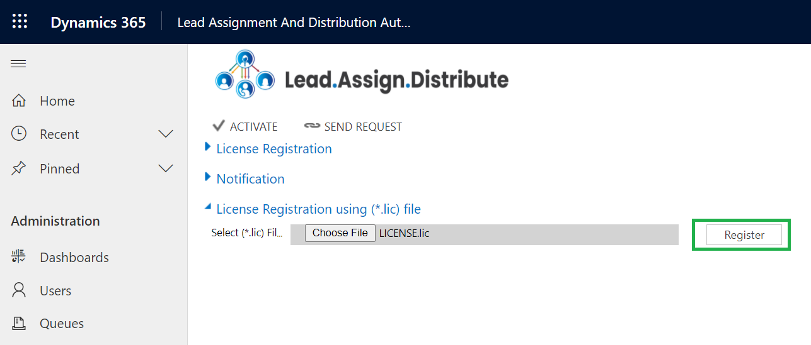

# License Activation

The first and foremost step after installing solution is License Activation.

Here are the steps to activate **Lead Assignment and Distribution Automation** license.

* Navigate to Dynamics 365 --> **Lead Assignment and Distribution Automation** app.

* Go to **License Registration**.

Enter the Details: First Name, Last Name, Company Name, Email, Website, and Main Phone --> Click on **ACTIVATE**.

If you want to purchase or extend the trial, click on **SEND REQUEST** --> Enter all details --> Click again on **SEND REQUEST** and send the email to Inogic.

### Alternate method to complete License Activation __&#x20;

Here are the steps to complete registration through the **‘License Registration using (.lic) file’** section.

* Request **.lic file** from Inogic --> **Save file** --> Go to **Lead Assignment and Distribution Automation app** --> **License Registration** --> Click ‘**Choose File**’ to locate the file with the **extension .lic**

* Select the file --> Click ‘**Open**.’

* Click on ‘**Register**’ to complete the License Registration.

* Your license will be now **activated.**

