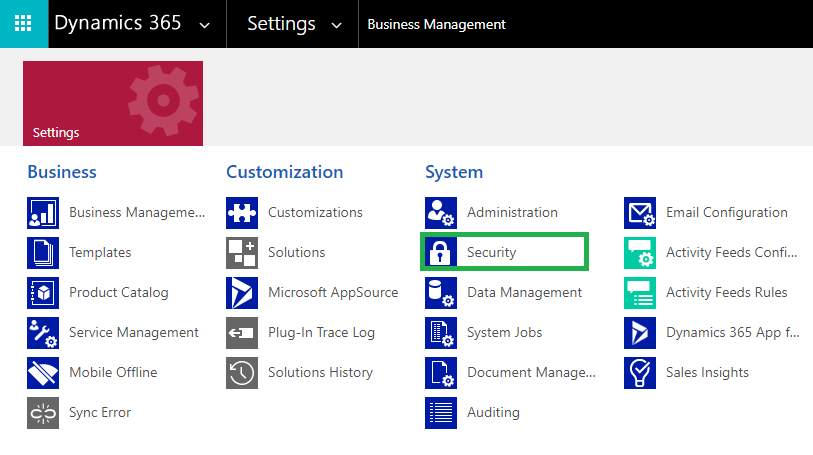
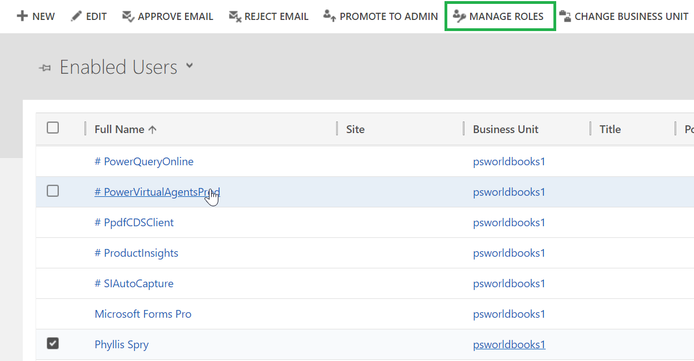
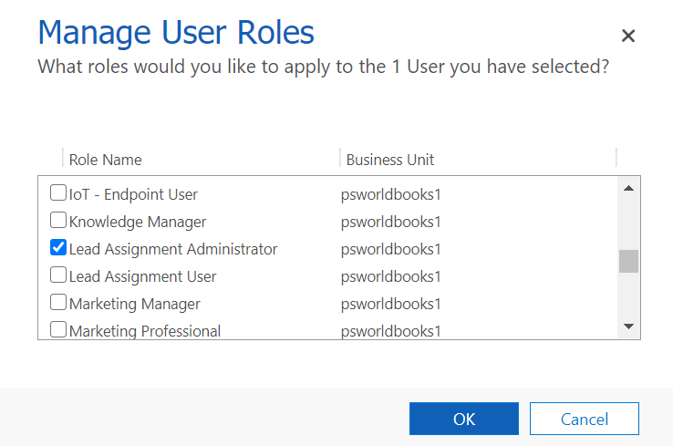

# Set up Security



The **Lead Assignment Administrator** is given the privilege for License Registration, creating Assignment Configuration and Assignment Rules.



This security role is to be assigned to all the users who are present in the automated assignment process.




**Note:**&#x20;

* **System Administrator has all the rights that Lead Assignment Administrator has**
* **Users should be given the privilege to auto assign entity records without which records will not get assigned**


Here are the steps to assign security role to users.

* Go to **Advanced Settings --> Settings --> Security.**

* Select **Users**

* Select user --> Click on **Manage Roles**

* Click on any one of the security roles --> Click **Ok**.

