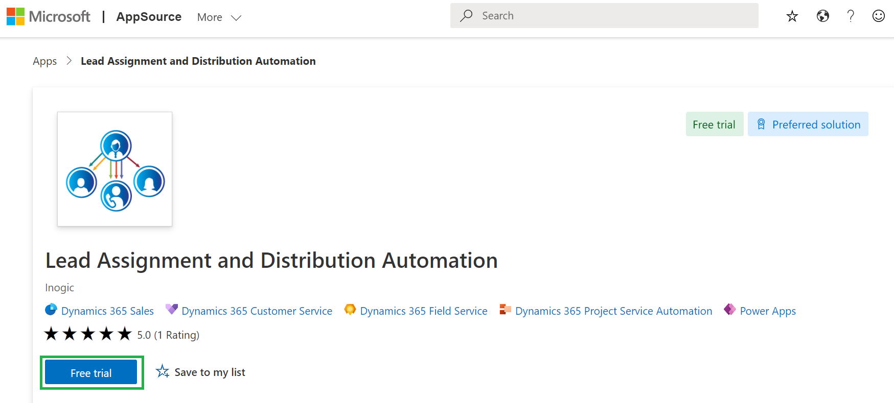
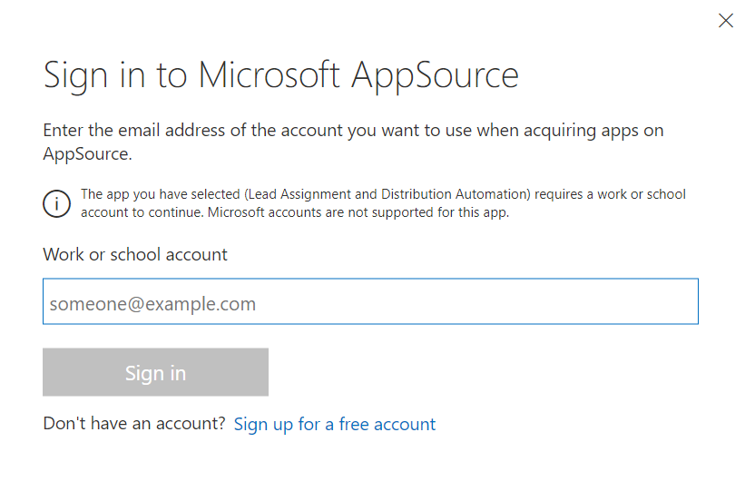
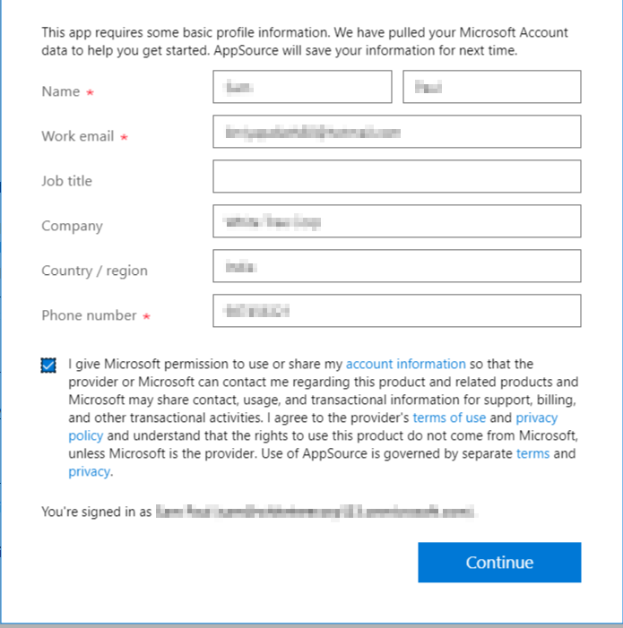
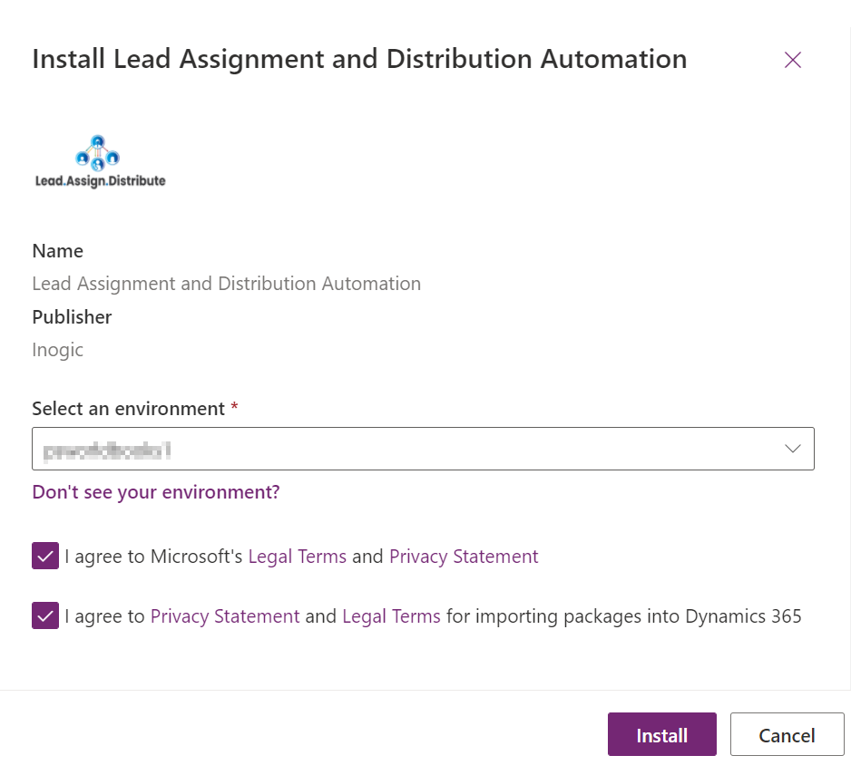
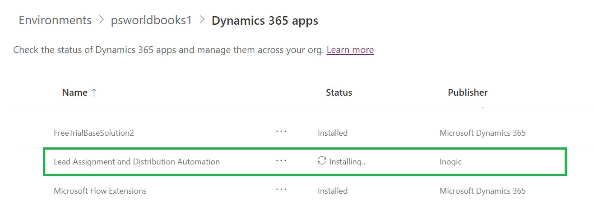

# Install from AppSource

To install **Lead Assignment and Distribution Automation** solution from the Microsoft AppSource, visit the [link](https://appsource.microsoft.com/en-gb/product/dynamics-365/inogic.lead-assignment-distribution-automation?tab=Overview) and follow the steps shown below.&#x20;

* Click on the '**FREE TRIAL**' button.

*   If the user is already logged into CRM, accept the terms & conditions and click on '**Continue**'. If the user is not logged into CRM, fill in the credentials and Sign in.

* Next, confirm the details in the form, accept the terms & conditions and click on '**Continue**'.

* Select an environment from the dropdown list given and then accept the privacy policies & legal terms. Proceed to the installation by clicking on the **Install** button.

* The installation process will now have started and you can check the status by refreshing the page.

* After the installation is done, you will be able to see **Lead Assignment and Distribution Automation** solution in your Apps section.


For further queries, reach out to us at [crm@inogic.com](mailto:crm@inogic.com)


