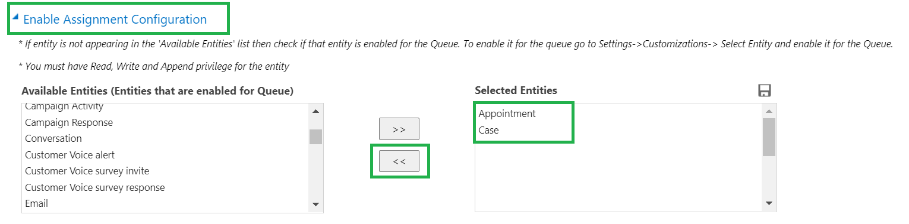
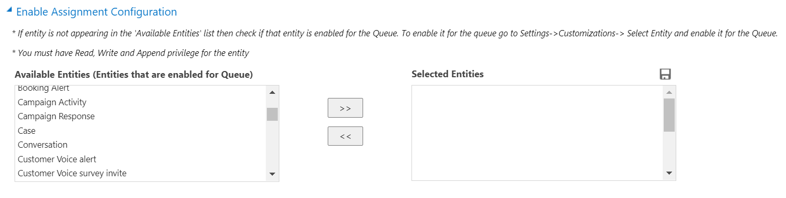
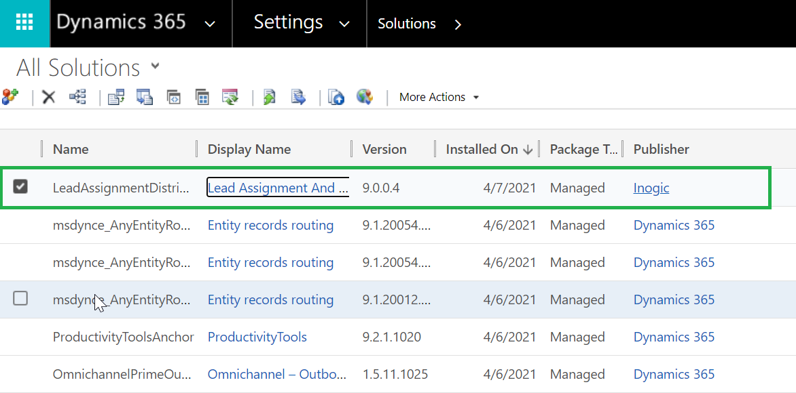
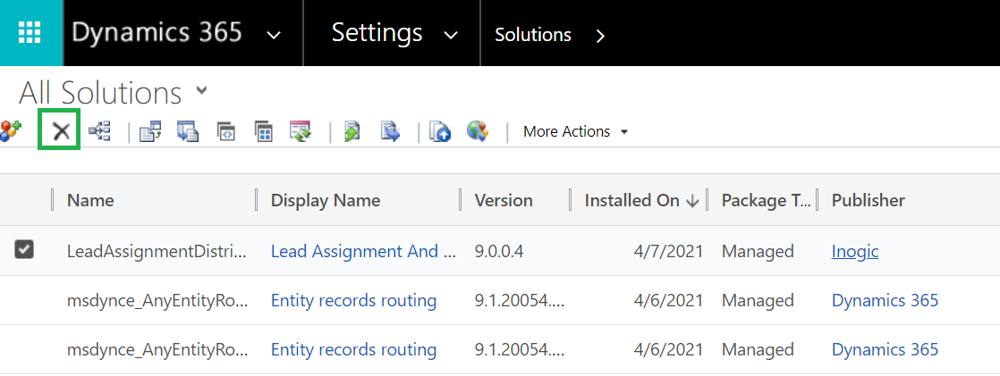
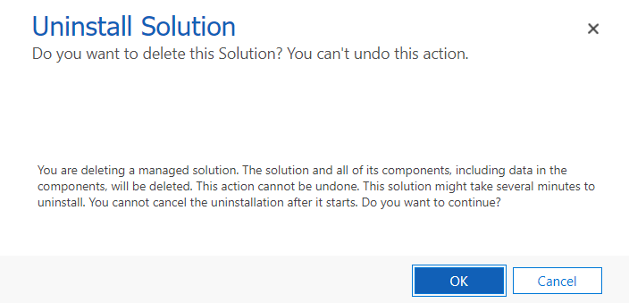

# Uninstallation

Follow the steps given below to uninstall **Lead Assignment and Distribution Automation** from your Dynamics 365 CRM and Power Apps environment.&#x20;

To uninstall the solution, at first you need to disable all the Assignment Configuration Records. This step is similar for both CRM and Power Apps.

1\) Navigate to **Lead Assignment and Distribution Automation -->** **Registration -- > Enable Assignment Configuration.** Next, **disable** all selected entities --> Click on **Save.**

2\) Ensure that **Selected Entities** column is **blank**.

### Uninstall from Dynamics 365 CRM

Now, navigate to **Settings** --> **Solutions** --> Select **Lead Assignment and Distribution Automation** solution.

Click on **delete** button. A pop-up will appear asking for your confirmation. Click on **OK** and the solution will be uninstalled from your environment.

### Uninstall from Power Apps

After removing the dependencies,  navigate to [make.powerapps.com](https://make.powerapps.com/)

* In Solutions, select the Lead Assignment and Distribution Automation solution and click on **Delete.**

* A pop-up will appear asking for your confirmation --> Click on **Delete** and the solution will be uninstalled from your environment.


For further queries, reach out to us at [crm@inogic.com](mailto:crm@inogic.com)


