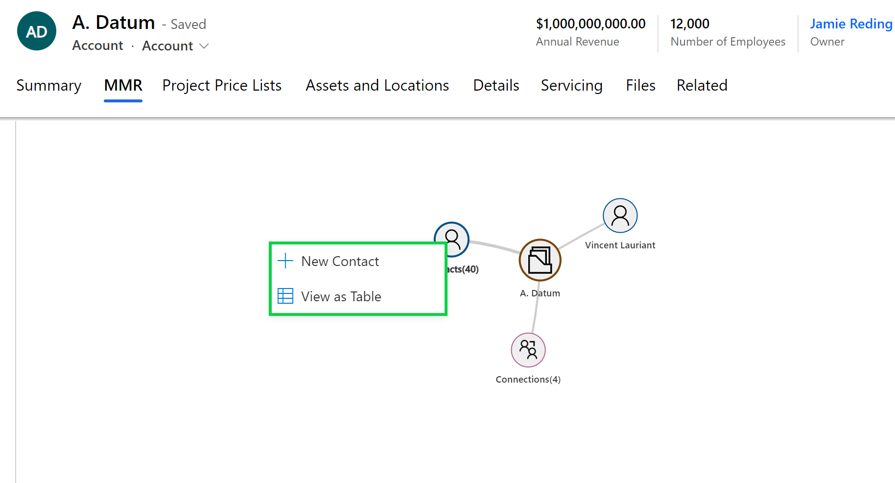
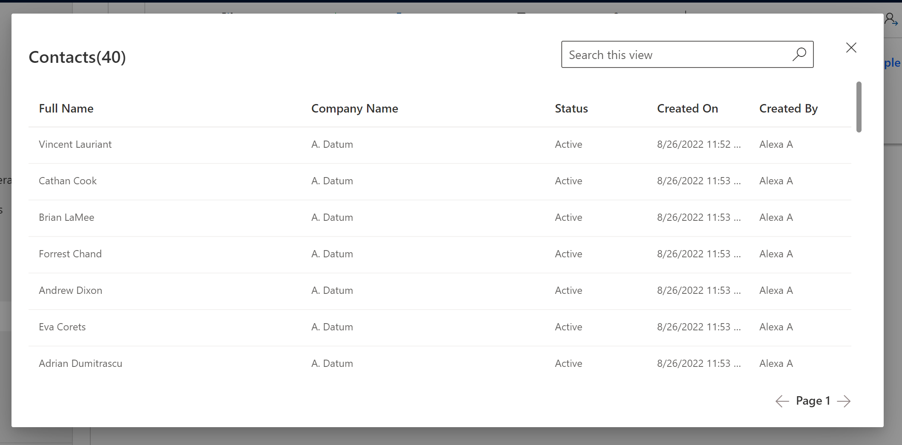

# View Relationships as Table

Map My Relationships lets users view the records in any entity node in the grid format as well. After the user has selected the desired view for the entity, they can view the same records in a read-only tabular format if needed.

The user needs to left-click on the entity node and then select the option 'View as Table' as shown below:

<figure><figcaption></figcaption></figure>

All the records in the selected entity node will then appear in the read-only grid format as shown in the below image.

<figure><figcaption></figcaption></figure>


**Note: This is available only for One-to-Many and Many-to-Many relationships.**


