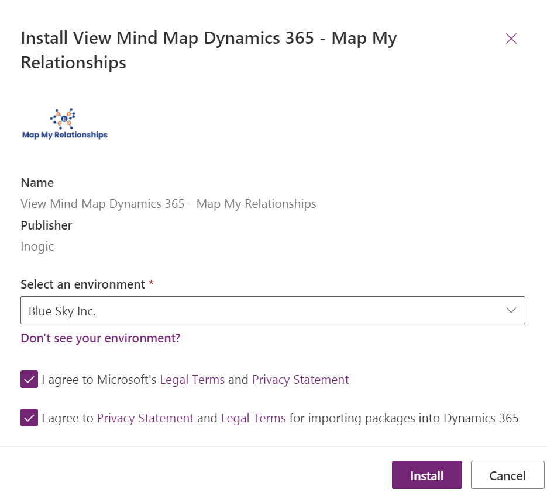

# Install from Microsoft AppSource

Install **Map My Relationships** solution from the **Microsoft AppSource** by visiting the [link](https://appsource.microsoft.com/en-gb/product/dynamics-365/inogic.view-mind-map-dynamics-365-relationships?tab=Overview) and following the steps shown below.

* Click on the **FREE TRIAL** button.

.png>)

* If you are already logged in then accept the terms & conditions and click on **Continue**.

.png>)

* If the you are not logged into CRM, fill in the credentials and **Sign in** to proceed further.

.png>)

* You will be asked to fill out a form as shown below. Fill the details in the form, accept the terms & conditions and click on **Continue**.

.png>)

* Now, select an environment from the list given and after accepting the privacy policies & legal terms, click on **Install** to proceed further.

* The installation process will be completed automatically but you can check the progress by refreshing the page.

* After the installation is done, you can see **Map My Relationships** solution in **My apps** in your Dynamics 365 CRM environment.

.png>)
