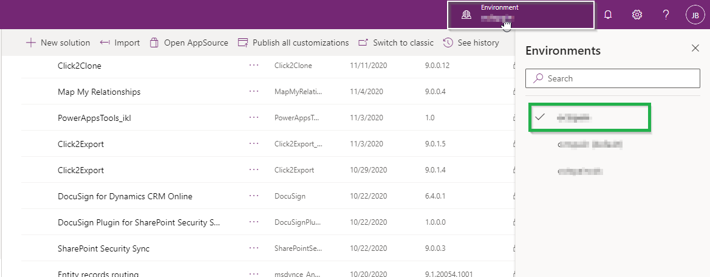

# Install from Website

Installation of Map My Relationships product from the website can be done in two different ways. They are shown below:

### Using Power Apps UI

To import the solution from make.powerapps.com, download the Map My Relationships solution from our [website](https://www.inogic.com/product/productivity-apps/map-my-relationships-dynamics-365-crm). Then follow the steps as shown below:

* Sign in to [Power Apps](https://make.powerapps.com/?utm\_source=padocs\&utm\_medium=linkinadoc\&utm\_campaign=referralsfromdoc). After signing in, select the instance on which you want to install the solution.

* From the left navigation, click on **Solutions** as shown below.

.png>)

* Click on **Import** on the command bar.

.png>)

* &#x20;On the **Import a solution** page, select **Browse** to locate the previously downloaded compressed (.zip) file that contains the solution.

.png>)

.png>)

* Select **Next**.

.png>)

* Then click on **Import** and proceed to import the solution.

.png>)

* After successful import, you can see the solution.

### Using Classic UI

You will have to download the solution from the **Inogic** [website](https://www.inogic.com/product/components/map-my-relationships-dynamics-365-crm) and then import the solution to your CRM environment to start the installation process.

Follow the step by step procedure given below:

* Navigate to **Advanced Settings** on Gear Icon on top right to import the solution.

.png>)

* Navigate to **Settings** --> **Solutions**.

 (1).png>)

* Click on **Import**.

.png>)

* Browse the downloaded file.

.png>)

* Check **Enable any SDK message processing steps included in the solution** and proceed to import the solution.

.png>)

Now, if you want to upgrade the solution to its latest version or reinstall the same solution, then you will get the following dialog box. Here, select the highlighted **'Upgrade'** point and the **'Overwrite customizations'** point for installing the latest solution. And for reinstalling the same solution, just select the **'Overwrite customizations'** point. Lastly, click on **Import** to start the installation process.&#x20;

Once you are done installing the solution in your environment the next step would be to activate the license.


For further queries, reach out to us at [crm@inogic.com](mailto:crm@inogic.com)


###

