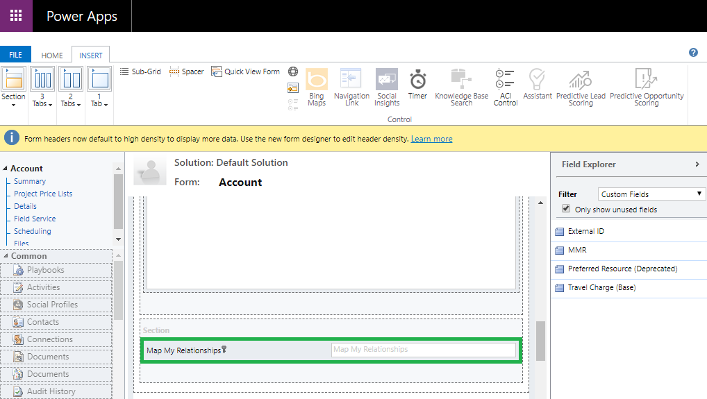
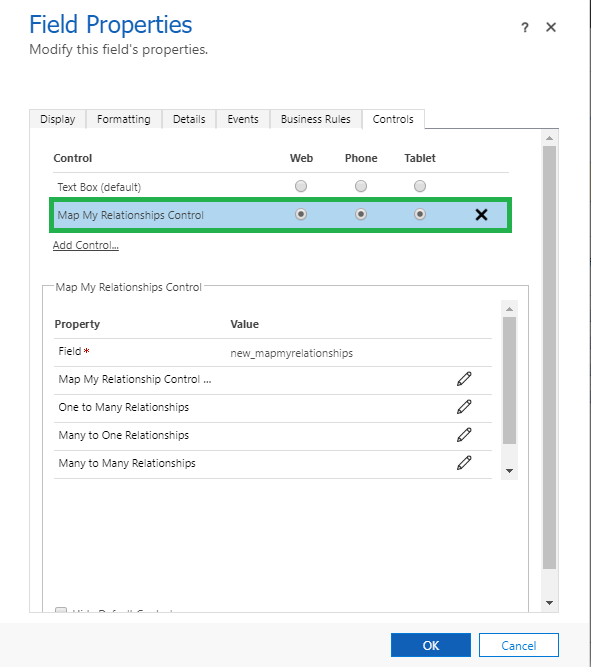

# Uninstallation

Uninstalling **Map My Relationships** solution from your CRM environment is quite simple. Just follow the below process to uninstall **Map My Relationships** from your Dynamics 365 CRM.


**Note: In order to uninstall Map My Relationship view, you first need to remove the dependency of Map My Relationships/Map My Connections control from the Entity Forms. If you have added the control on any entity forms then remove that control from the form. In below steps we have taken the example of Account entity.**


1\) Navigate to **Settings** ->**Customizations** ->**Customize the System.**

.png>)

2\) From there go to **Entities** ->**Account** ->**Forms** ->Select the respective ‘Form’ for which controls are set.

.png>)

3\) Double click on **Form** ->Click the field on which control is set.

4\) Now go to **Controls** -> Delete **Map My Relationships** Control -> Click **OK** -> Click on **Save and Publish**.

5\) Similarly, to remove Map My Connections control, go to **Default Solution** -> Select **Opportunity** -> **Forms** -> **Main Form**.&#x20;

.png>)

6\) Double click on **Form** -> Click the field on which control is set.

7\) Now go to **Controls** -> Delete **Map My Connections** Control -> Click **OK** -> Click on **Save and Publish**.

8\) Next, navigate to **Settings** --> **Solution** --> Select **Map My Relationships** solution.

.png>)

9\) Click on **delete** button. A pop-up will appear asking for your confirmation. Click on **OK** and the solution will be uninstalled from your environment.

.png>)

.png>)
