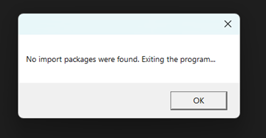

# FAQs

## 1) What to do when all the syncs (Marketing Lists/Campaigns) are stuck in 'In Progress' status and there are no error logs created?

There are Power Automate Flows that take care of the whole syncing process. In case of above situation, please check if all the flows are turned on for the environment by following the steps given below:

* Sign in to **flow.microsoft.com**
* Click on **Solutions** --> Open **Marketing4Dynamics Mailchimp Integration** solution.

* Click on **Cloud flows** --> Verify if the status of all the flows is **'On'** --> If any of them is turned **'Off'**, kindly turn them **'On'**.

* After turning on the flows sync the respective Marketing Lists/Campaigns.

## 2) What to do if there is a lack of space for Database storage in the environment due to excess Inogic-related logs?

To mitigate this issue, you can do two things:

1. &#x20;Stop plug-in trace logs that were previously turned on.
2. &#x20;Start a bulk deletion job that will delete Marketing4Dynamics Log records that are older than 2 months.

**1) To stop the plug-in trace log follow the steps given below:**

* Click on the **gear icon** -->Select **Advanced Settings**.

* Go to **Administration** -->Select **System Settings**.

* Click on **Customization** --> Set **'Enable logging to plug-in trace log'** to **Off** -->Click on **OK**.

This will turn off the plug-in trace log.

**2) To delete previously created logs follow the steps given below:**

* Go to **Advanced Settings** --> Select **Data Management** -->Select **Bulk Record Deletion** --> Click on **New**.

* Click on **Next**.

* Define which records you want to get deleted by using the below query. _**(Note:- You can choose to delete records older than 1 month as well).**_

* Give a relevant name to the bulk deletion job. Select at what time you want to start this job. _**(Note:- You can choose to run this job every 60 days if you want to by turning the option on).**_

* Click on **Next** -->Submit the bulk deletion job.

## 3) What does the below error mean and how to resolve it?

<figure><figcaption></figcaption></figure>

The above error occurs when you have inserted the wrong URL while connecting Mailchimp to CRM. The URL should look something like "[https://us6.api.mailchimp.com/3.0/](https://us6.api.mailchimp.com/3.0/)" and not "[~~https://us6.admin.mailchimp.com~~](https://us6.admin.mailchimp.com)~~"~~

## 4) **Can I use a dynamic marketing list to sync between CRM and Mailchimp?**

According to the value in the 'Targeted At' field of the Marketing List, Marketing4Dynamics will create new members (contacts/leads) when syncing members from Mailchimp to CRM.&#x20;

Furthermore, we also associate those members with the selected marketing list. Since a dynamic marketing list runs on a query dynamically, there is no way to associate contacts/leads with a dynamic marketing list. Because of this, we can't sync the members of a dynamic marketing list while syncing Mailchimp to CRM.

However, after the initial sync, in which the entire audience or a specific segment is transferred to the CRM, syncing from the CRM to Mailchimp using a dynamic marketing list is very much possible.\

## 5) What to do if the "No import packages were found. Exiting the program" error message pops up when trying to install Marketing4Dynamics?

<figure><figcaption></figcaption></figure>

**To resolve this issue, follow the steps given below to install Marketing4Dynamics:**

* Extract the zip file you’ve downloaded and right-click on _Inogic.Marketing4Dynamics.PackageDeployer.dll_ file inside the _Marketing4Dynamics\_PackageDeployer_ folder.
* Click on **"Properties."**

<figure><figcaption></figcaption></figure>

* Click on the checkmark beside **"Unblock."** Click on **"Apply"** and then **"OK."**

<figure><figcaption></figcaption></figure>

* Click on **PackageDeployer.exe** again and follow the next steps from the **ReadMe.md file.**

&#x20;
