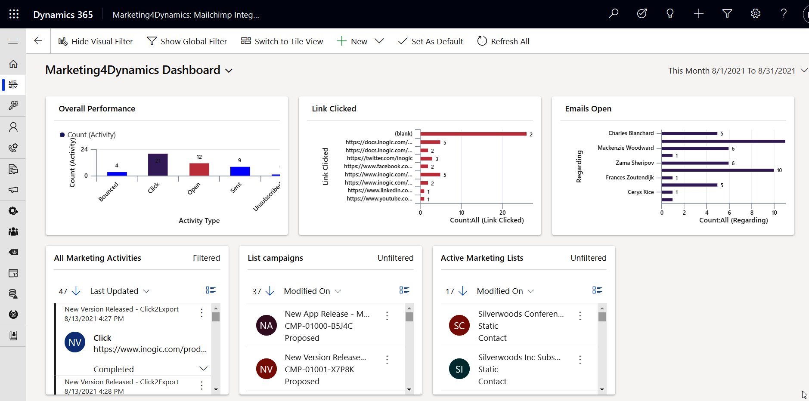

# Dashboard & Reporting

By using dashboards, Marketing4Dynamics will directly provide graphical representations of campaign and member activities (Open, Sent, Click, Unsubscribed, and Bounced) in the CRM. This makes it easy to analyze the overall performance of different marketing campaigns. In the future, this analysis will help plan and develop marketing activities that will interest the customers, resulting in higher sales and profit.

<figure><figcaption></figcaption></figure>


For further queries, reach out to us at [crm@inogic.com](mailto:crm@inogic.com)

