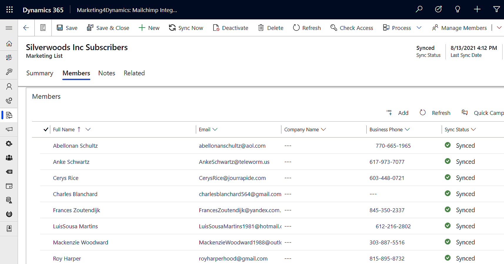

# Sync Contacts/Leads from CRM to Mailchimp

CRM Marketing List members (Contacts/Leads) can be synced with Mailchimp using Marketing4Dynamics. By syncing marketing lists, it is possible to promote CRM contacts and leads (clients) to Mailchimp. This proves helpful while planning campaigns and marketing activities targeting these customers in CRM. The marketing team can also save time as they do not have to create new audiences in Mailchimp.

<figure><figcaption></figcaption></figure>
