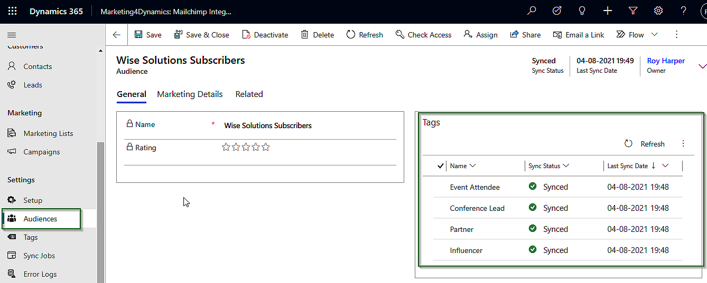

# Sync Mailchimp Audiences, Members and Tags to CRM

Mailchimp Audience is where all your contacts/members and tags are stored. Marketing4Dynamics allows you to sync Mailchimp's audience and tags, as well as its members, to Dynamics 365 CRM and map them to CRM marketing lists. With the help of this feature, users can now easily sync Mailchimp audiences to Dynamics 365 CRM.

<figure><figcaption></figcaption></figure>


For further queries, reach out to us at [crm@inogic.com](mailto:crm@inogic.com)

