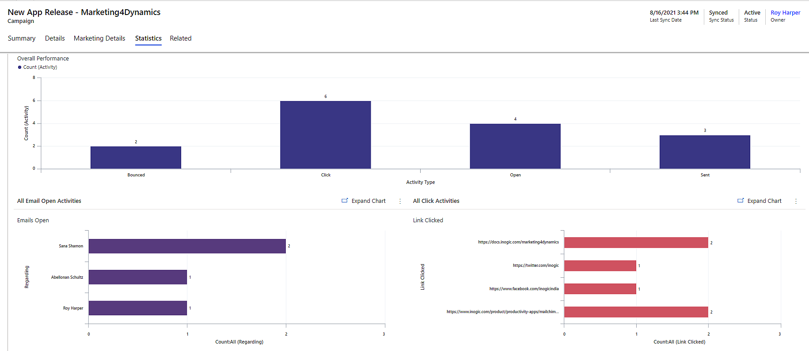

# Sync Mailchimp Campaigns and Activities to CRM

Marketing4Dynamics enables the syncing of campaigns and member activities (Open, Sent, Click, Unsubscribed, and Bounced) from Mailchimp to Dynamics 365 CRM. Statistics for various campaigns and member activities conducted using Mailchimp will be easily accessible within Dynamics 365 CRM. This is quite useful for creating and implementing future sales strategies.

<figure><figcaption></figcaption></figure>
