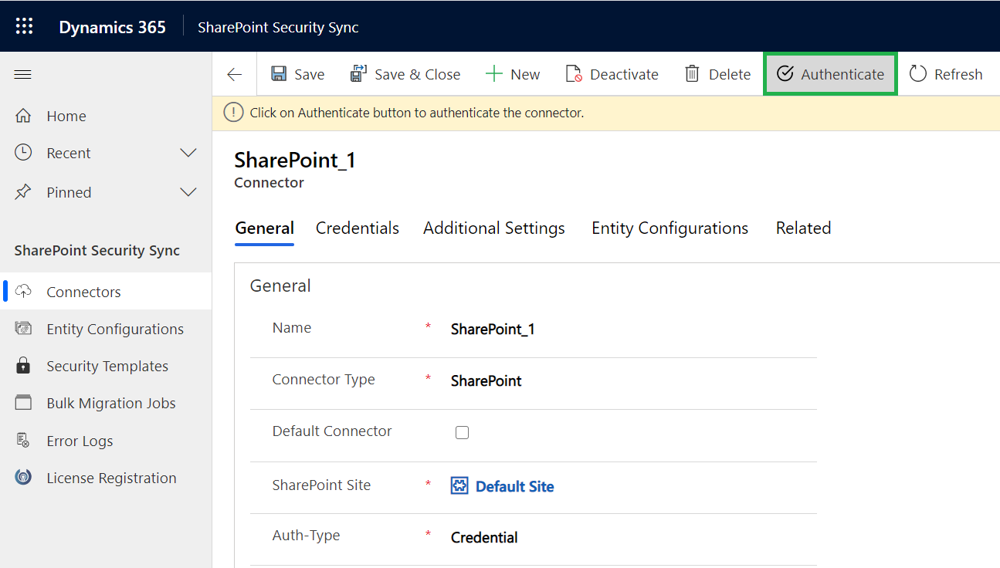

# Connector Configuration

In SharePoint Security Sync the user can configure multiple connectors for SharePoint. For example: The user can create multiple connectors such as SharePoint\_1, SharePoint\_2, SharePoint\_3, etc. for SharePoint.&#x20;

To achieve this, follow the steps given below:

* Navigate to **SharePoint Security Sync App** --> Click **‘Connectors’** Entity --> Click **‘New’** to create a new **‘Connector.’**

* Populate the following fields:
  * **Name:** Give name to the connector&#x20;
  * **Connector Type:** Choose SharePoint from the drop-down.&#x20;
  * **Default Connector:** If required, enable the checkbox to set SharePoint\_1 as default connector.
  * **SharePoint Site:** It is the location of SharePoint, where files and folders will be stored. Select the valid SharePoint site here.
  * **Auth-Type:** The Auth-Type is of two types - **Credential and App.**
  * **Enable DocuSign Integration:** Enable the checkbox to make use of DocuSign features.
  * **Signed document naming convention:** Select the naming convention of the document which is stored in CRM by DocuSign when all parties have signed the document.

DocuSign - [https://appsource.microsoft.com/en-us/product/dynamics-365/docusign.3701c77e-1cfa-4c56-91e6-3ed0b622145a?tab=Overview](https://appsource.microsoft.com/en-us/product/dynamics-365/docusign.3701c77e-1cfa-4c56-91e6-3ed0b622145a?tab=Overview)

DocuSign Plugin integration solution - [http://www.inogic.com/Assets/Trial/DocuSignPluginforSharePointSecuritySync\_1\_0\_0\_0\_managed.zip](http://www.inogic.com/Assets/Trial/DocuSignPluginforSharePointSecuritySync\_1\_0\_0\_0\_managed.zip)


**Note:**

* **User cannot reuse the same SharePoint site for each new connector.**
* **To use DocuSign feature from Attach2Dynamics UI it is necessary to install DocuSign  and DocuSign Plugin for SharePoint Security Sync** **solution in Dynamics 365 CRM.**


.png>)

### Credentials:

This indicates that **Authentication** with the connector is done through **Credential i.e. id and password**. It is mandatory to enter credentials in order to create a new Connector. For authentication through credentials, for any attachment action, the name of user appears who has authenticated the Connector. Enter value for **Id** and **Password/Secret.** Next authenticate the credentials.

.png>)


**Note: In the Id field enter your username and in Password/Secret field enter password. It can be your normal Dynamics 365 CRM credentials.**&#x20;


### App:

This is to provide authentication with App. In App authentication, if any action is performed then the name of logged-in user appears.

In order to know how to generate Id and Password/Secret for App [click here](https://www.inogic.com/blog/how-to-create-azure-active-directory-app/). After you have generated the Id and Password enter them in the fields provided.

.png>)

After the Connector record is created the connector credentials need to be authenticated.

To authenticate the connector, click on the **Authenticate button** on the command bar.&#x20;

Please ensure the credentials are correct and you have **Global Administrator** privileges and also are a **SharePoint site owner.**

This button is visible only to users with **System Administration** or **SharePoint Security Sync Administrator** role.

Once the **Authenticate** button is clicked, a Pop-up window will appear. Fill in your credentials and then confirmation Pop-up will be opened.&#x20;

In the Pop-up, please select **Consent on behalf of your organization** --> Click on the **Accept** button.

After clicking on the Accept button if the credentials are correct then you will get a Success message window.

Now if any logged in user uploads or performs any attachment action on files in SharePoint, their name will appear for the action. Let’s upload few files and see how it works.

Here, the name of the admin appears when they are logged in and have uploaded the file.

Now let’s take another use-case when a user, who is not an admin uploads a file. Veronica is a Sales Manager who does not have admin rights. Now she uploads the files while being logged in, and her name appears as the user uploading the file.


**Note: SharePoint Security Sync supports multiple SharePoint sites and syncs the privileges with ease.**

