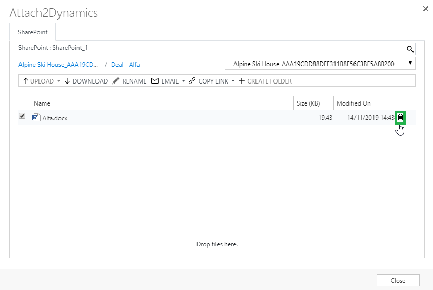

# Delete

Users can delete files from SharePoint.


**Note: In order to delete files from SharePoint, it is necessary to enable checkbox for** [**'Delete Files'** ](https://docs.inogic.com/sharepoint-security-sync/features/security-templates#permissions)**feature in Permissions using Security Templates.**


