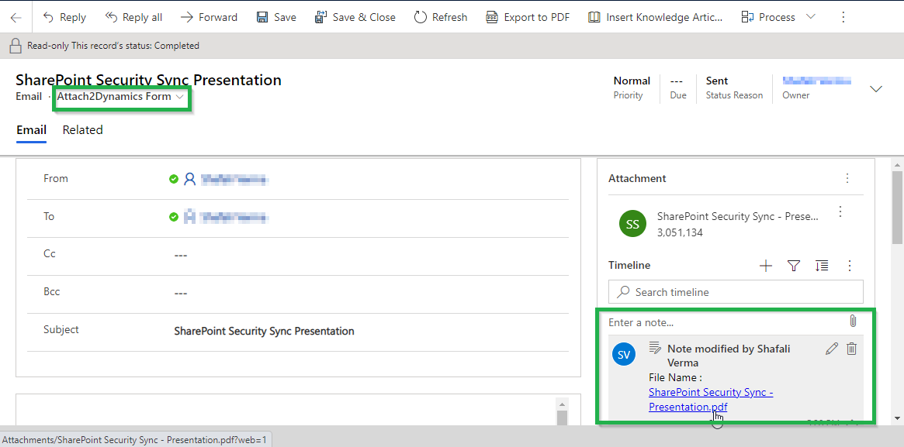

# Move/Copy Attachments

Users can move/copy Dynamics 365 CRM Notes Attachments/Email Attachments and Sales Literature Attachments to SharePoint.

### **Notes:**&#x20;

If enabled, it’ll move/copy the Note Attachments to the respective entity folder and leave a a hyperlink of the path in Note Body.

.png>)

### Email Attachments:

If enabled, it’ll move/copy the Email Attachments to a common folder called Email Attachments or Regarding folder and leave a hyperlink of the path in Note Body.

### Sales Literature Attachments:

If enabled, it’ll move/copy the Sales Literature Attachments to the respective Sales Literature folder and leave a hyperlink of the path back in Cloud Storage Links section.

