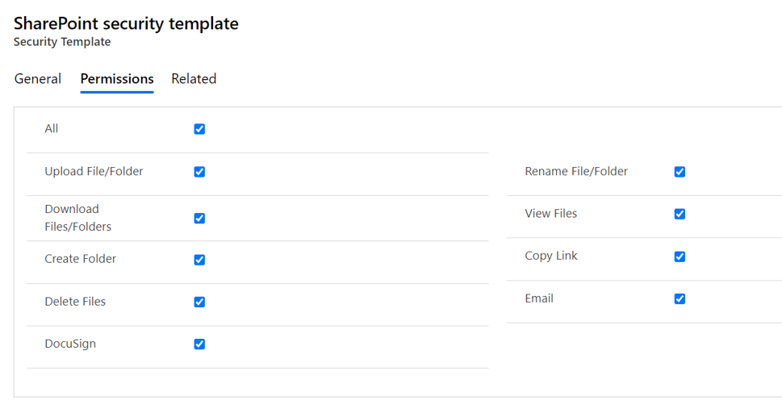

# Security Templates

Security Templates Entity enables to control access given to the users over various features of Attach2Dynamics such as Upload, Download, Email, Copy Link, Rename etc. in SharePoint.


**Note: If two records of security template are created for the same user then the user will get highest access permission from either of the records.**


To configure Security Templates, go to **SharePoint Security Sync App --> Security Templates --> Click on '+New' --> Fill the respective fields.**

#### General:&#x20;

This section is where you define the name of record and the connector to SharePoint.

Populate the given fields and save the changes. After the changes are saved you need to select users to whom this security template should apply.

<figure><figcaption></figcaption></figure>

#### Permissions:

Permissions comprises of all the Attach2Dynamics features. To provide access to Attach2Dynamics features just enable the checkbox given against each and every feature.

 

<figure><figcaption></figcaption></figure>

After filling the respective fields, click on **'Save'**.


**Note:**

* **If no template is created for a user, then all the features would be enabled except the Delete feature.**
* **For Delete feature a Security Template is must.**



For further queries, reach out to us at [crm@inogic.com](mailto:crm@inogic.com)


##
