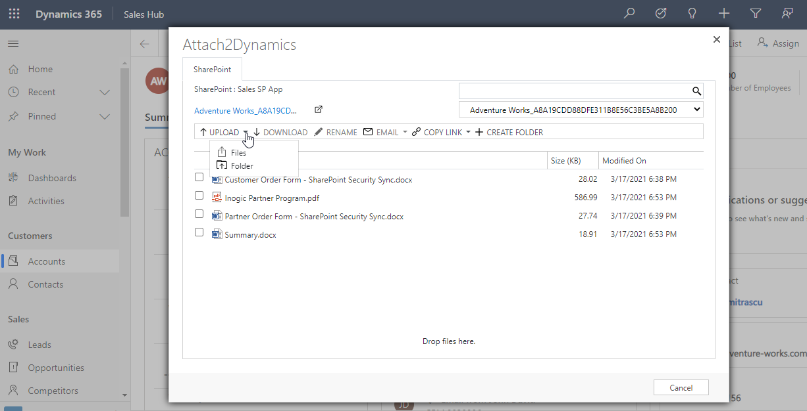

# Upload

Users can upload multiple files and single folder at a time using the solution. They get user-friendly UI to see the list of files uploaded on SharePoint against the current record. Upload Folder through button is not available on IE.


For further queries, reach out to us at [crm@inogic.com](mailto:crm@inogic.com)


