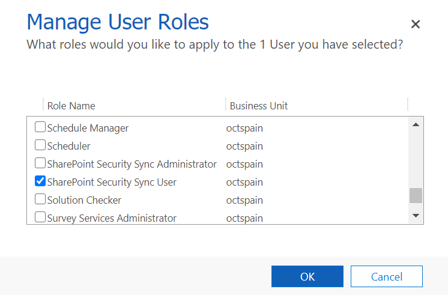

# Set up Security

**SharePoint Security Sync** has the following security roles:



**SharePoint Security Sync Administrator** has the privilege to create and modify '**Entity Configurations**', '**Connector entity records'**, '**Security Templates'**, and '**Bulk Migration Jobs'**.



**SharePoint Security Sync User** will be able to '**Read**' and can create '**Bulk Migration Job'** and utilize all the Attach2Dynamics features in SharePoint such as Upload, Download, Create, Delete, etc.




**Note: It is necessary to assign any one of the above security roles to use SharePoint Security Sync Solution**


Follow the simple steps given below to assign security roles to CRM users.

* Navigate to **SharePoint Security Sync App** --> **License Registration** Page --> Click on the **Assign Security Role** button.

* A confirmation dialog box will appear. Click on **Ok.**

The **SharePoint Security Sync user** security role will be now assigned to all the users present in Dynamics 365 CRM.

OR, you can follow another alternative method mentioned below:

* Go to **Advanced Settings** --> **Settings** --> **Security**.

.png>)

* Select **Users**

.png>)

* Select user --> Click on **MANAGE ROLES**

* Click on any one of the security roles --> Click **OK**.

.png>)

