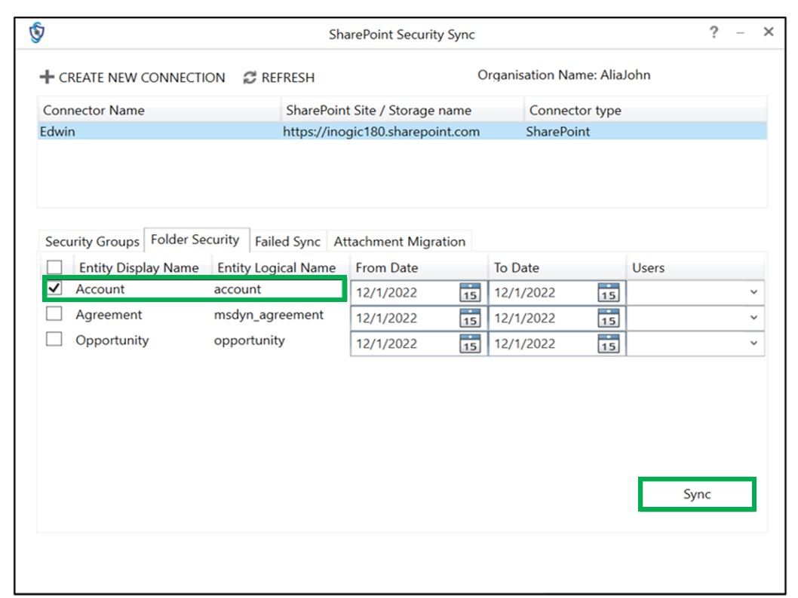

# SharePoint Security Sync Tool

SharePoint Security Sync Tool (Bulk Synchronization Tool) enables you to sync previous records in bulk. It relatively takes less time to sync records with SharePoint Security Sync Tool.&#x20;

**Pre-requested:- .NET Framework 4.6.2 or above.**

#### How to use SharePoint Security Sync Tool?

* Download and install SharePoint Security Sync Tool in your system. You can download the tool from [here.](https://www.inogic.com/product/productivity-apps/dynamics-365-crm-sharepoint-security-metadata-sync)
* After installing, click on the SharePoint Security Sync Tool icon to open the tool.

* Select deployment type as **‘Office 365’** and fill the following details in given fields.
  * **Display list of available organizations:** Enable the checkbox in case of multiple organizations in CRM&#x20;
  * **Online Region:** Select the respective region&#x20;
  * **Username:** Use the CRM username&#x20;
  * **Password:** Use the CRM password
* After filling all the details click on **‘Login’**.

#### SharePoint Security Sync Tool Functions&#x20;

Once logged in, you will find details of all the configured connectors. Select any one of the connectors for which you want to sync the security privileges. If more connectors are added then click on ‘Refresh’ button on the top to update connector details.

Now let’s go through the different functions of SharePoint Security Sync Tool.&#x20;

* First click on the respective SharePoint Site.
* After clicking on respective SharePoint Site, **four** new tabs will be displayed – **Security Groups, Folder Security and Failed Sync, Attachment management.**

* Now, click on first tab – **Security Groups**. Here, all the existing configured entities will be displayed. Select any entity. After selecting the entity, two buttons will appear – **Sync and Delete Groups**. Click on **‘Sync’** button to create groups against that entity. Click on **‘Delete Groups’** to delete all the existing groups against that entity.

*   &#x20;Next tab is **Folder Security**. With this tab, you can **synchronize** records for a selected period. You can also select particular user/users from the **drop-down menu** and apply **folder security** to the records they owned.

    **For example**, if your CRM has 7 users and you want to sync records of only 2 particular users for “Account” entity, created during a particular period, then you can select those two specific users from the dropdown menu and click on Sync button as shown in the below-given image in order to sync records.

.jpg>)

* &#x20;**Note:** If you will not select any user then the folder security syncing will be applied to all the records owned by the users for that selected period.

<figure><figcaption></figcaption></figure>

* The third tab is **Failed Sync**. Click on the **‘Sync’** button to sync all the failed records.

* The last tab is to perform the **Bulk Migration Job** i.e. Move/ Copy the past attachments from Dynamics CRM to SharePoint. You are required to fill the following fields for smooth migration of attachments:
  * **For?**: This specifies whether you are doing Bulk Migration for Emails, Notes or Sales Literature.&#x20;
  * **Entity:** Select the entity for which you want to migrate attachments.
  * **Action:** Select either 'Copy' or 'Move'.
  * **From:** Enter the date from which you want to start the migration job.
  * **To:** Enter the end date till which you want to do the migration.


For further queries, reach out to us at [crm@inogic.com](mailto:crm@inogic.com)


