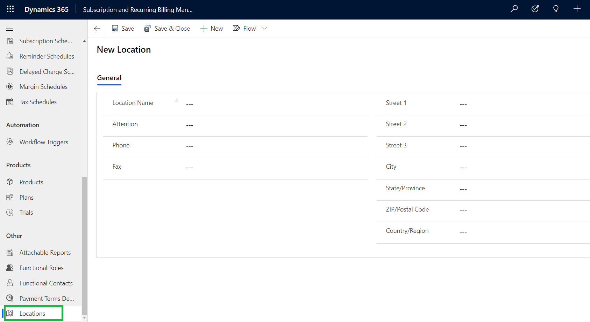

# Location

The Location entity is used to list the **Ship from** addresses of different locations used for the purpose of business such as warehouses, offices, shops, etc.


For further queries, reach out to us at [crm@inogic.com](mailto:crm@inogic.com)

