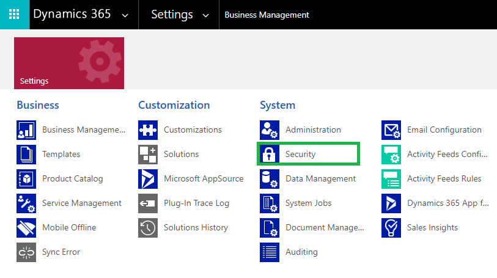

# Set up Security

**User Adoption Monitor** has the following security roles:



**User Adoption Monitor Administrator** is given the privilege for License Registration, Enable Entity Configurations, and has organization level access of all entities of **User Adoption Monitor** and '**Connector**' entity records.



**User Adoption Monitor User** can view Entity Configurations and Tracking records.




**Note: It is necessary to assign any one of the above security roles to use User Adoption Monitor Solution**


Follow the steps below to assign security roles to users.

* Go to **Advanced Settings** --> **Settings** --> **Security**.

* Select **Users**

* Select user --> Click on **Manage Roles**

* Click on any one of the security roles --> Click **Ok**.


For further queries, reach out to us at [crm@inogic.com](mailto:crm@inogic.com)

