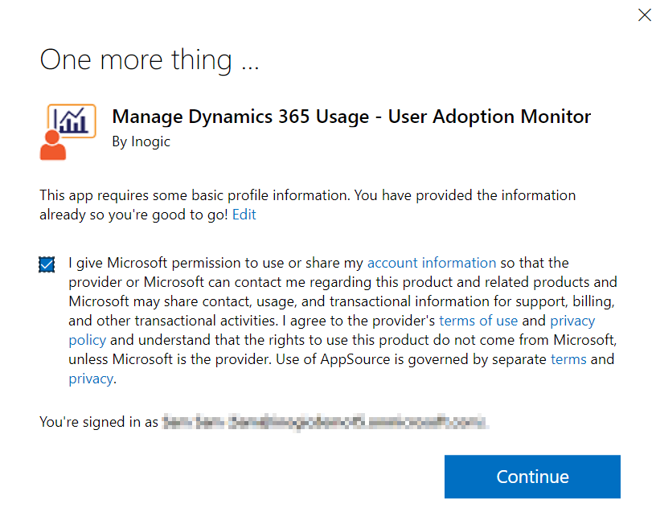
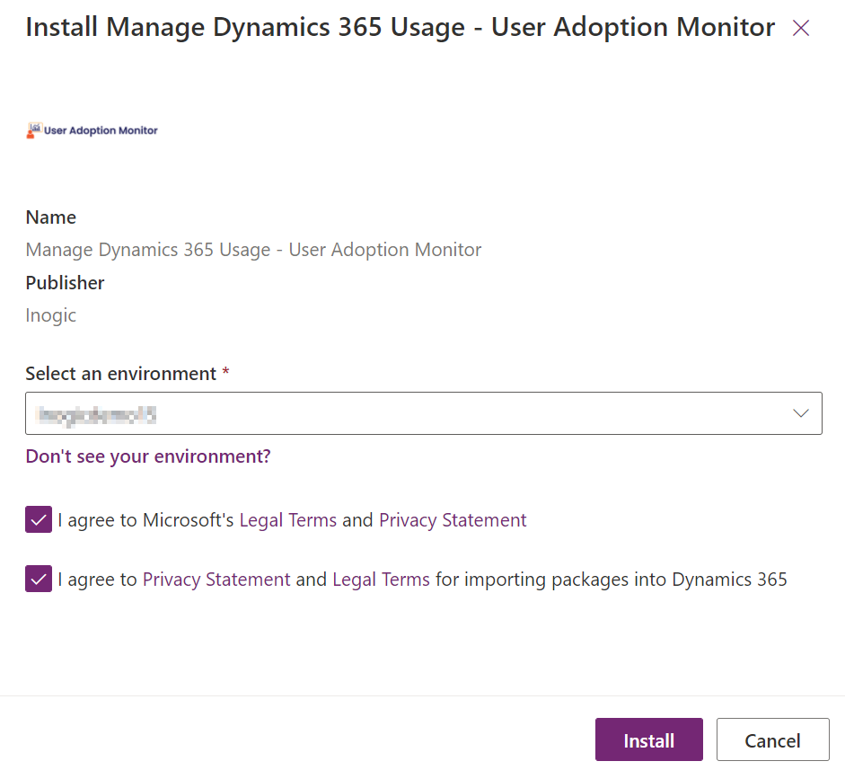
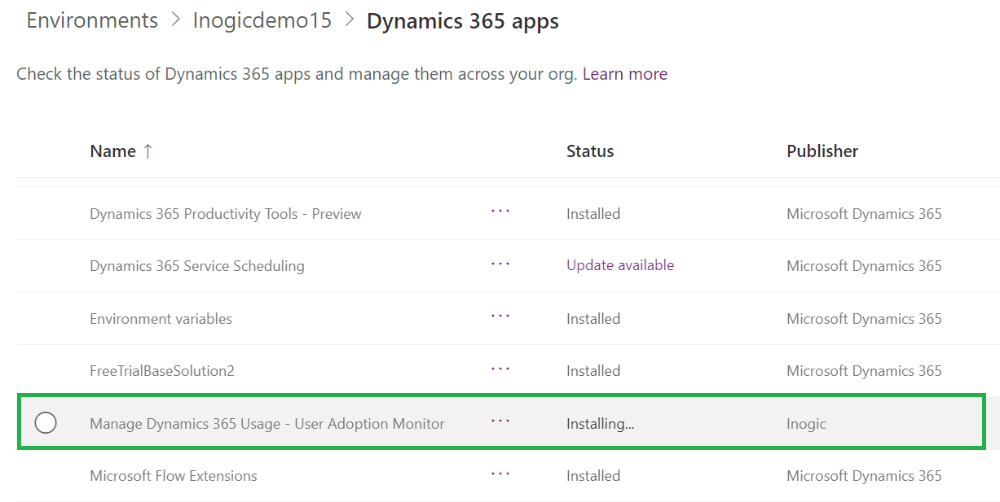

# Install from Microsoft AppSource

To install **User Adoption Monitor** solution from **Microsoft AppSource**, click[ here ](https://appsource.microsoft.com/en-us/product/dynamics-365/inogic.728355ef-5b19-45f6-bb63-9680886e551a)and follow the steps given below:&#x20;

* Go to User Adoption Monitor page on Microsoft AppSource --> Click on the **FREE TRIAL** button.

.png>)

* If you have already logged into CRM, accept the terms & conditions --> Click on **Continue**.&#x20;

* If you have not logged into CRM, fill in the credentials and **Sign in**.

.png>)

* Next, confirm the details in the form --> Accept the terms & conditions --> Click on **Continue**.

.png>)

* Now, select an environment from the dropdown list and accept the privacy policies & legal terms by clicking on the checkboxes --> Click on **Install** to proceed further.

* The installation process will start shortly --> Keep checking the status at regular intervals by refreshing the page.

* Once the installation is completed, **User Adoption Monitor** solution will be visible in **Apps**.

