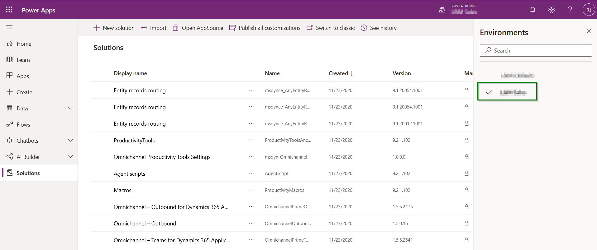
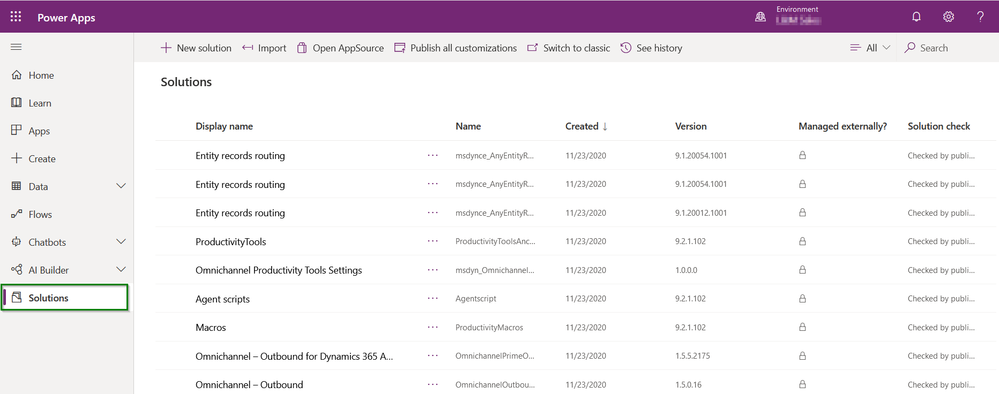
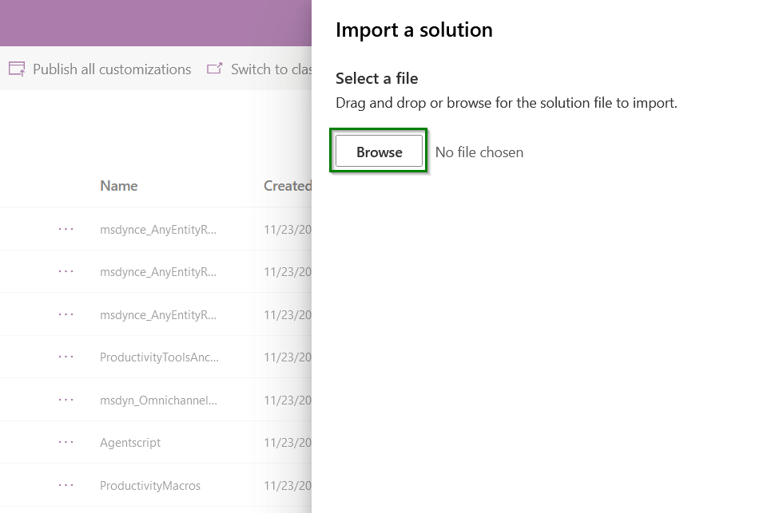
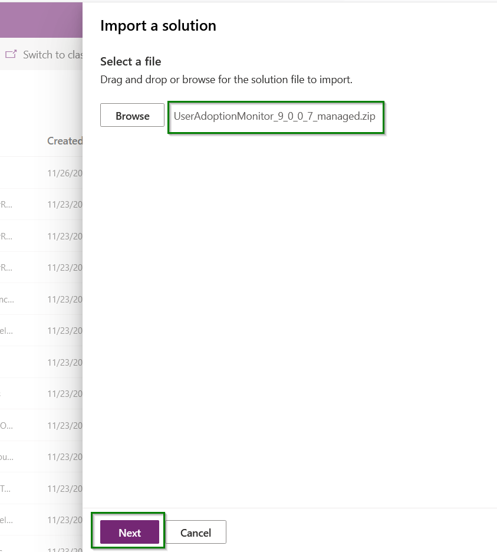
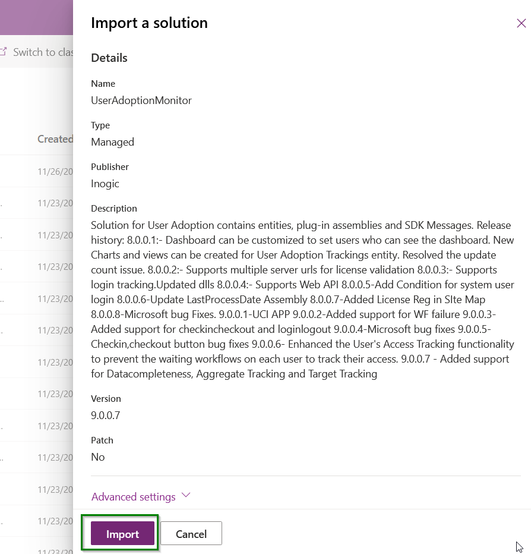
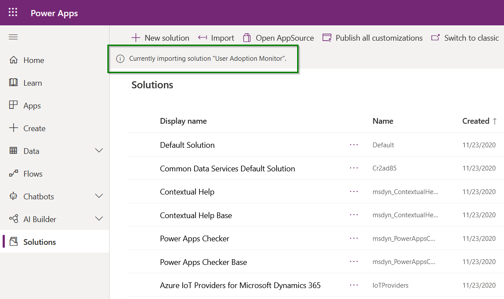
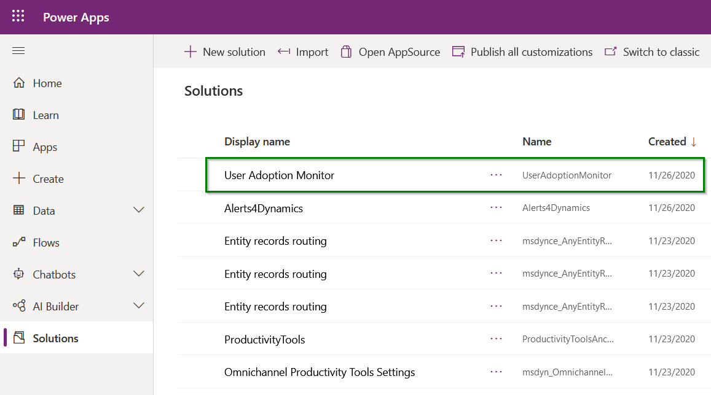

# Install from Website

Use any of the two methods to install User Adoption Monitor from our [website](https://www.inogic.com/product/productivity-apps/user-adoption-monitor-in-dynamics-crm).

### Using Power Apps UI

To import the solution from make.powerapps.com, download the User Adoption Monitor solution from our [website](https://www.inogic.com/product/productivity-apps/user-adoption-monitor-in-dynamics-crm). Then follow the steps as shown below:

* Sign in to [Power Apps](https://make.powerapps.com/?utm\_source=padocs\&utm\_medium=linkinadoc\&utm\_campaign=referralsfromdoc). After signing in, select the instance on which you want to install the solution.

* From the left navigation, click on **Solutions** as shown below.

* Click on **Import** on the command bar.

.png>)

* &#x20;On the **Import a solution** page, select **Browse** to locate the previously downloaded compressed (.zip) file that contains the solution.

.png>)

* Select **Next**.

* Then click on **Import**.

* Your solution will get imported in the background. To check the status of the installation, refresh the page.

As you can see, the User Adoption Monitor is installed in your CRM environment.

### Using Classic UI 

To install User Adoption Monitor solution, you have to download the solution from the website and then import the managed solution to your CRM environment.

Here are the steps to import and install User Adoption Monitor solution.

* Navigate to Advanced Settings on Gear Icon on top right to import the solution.

.png>)

* Navigate to Settings --> Solutions.

.png>)

* Click on Import.

.png>)

* Browse the downloaded file.

.png>)

* Check ‘Enable any SDK message processing steps included in the solution’ and proceed to import the solution.

.png>)

Now, if you want to upgrade the solution to its latest version, then you will get the following dialog box. Here, select the highlighted part and click on **Import** to install the updated/higher version of User Adoption Monitor.

