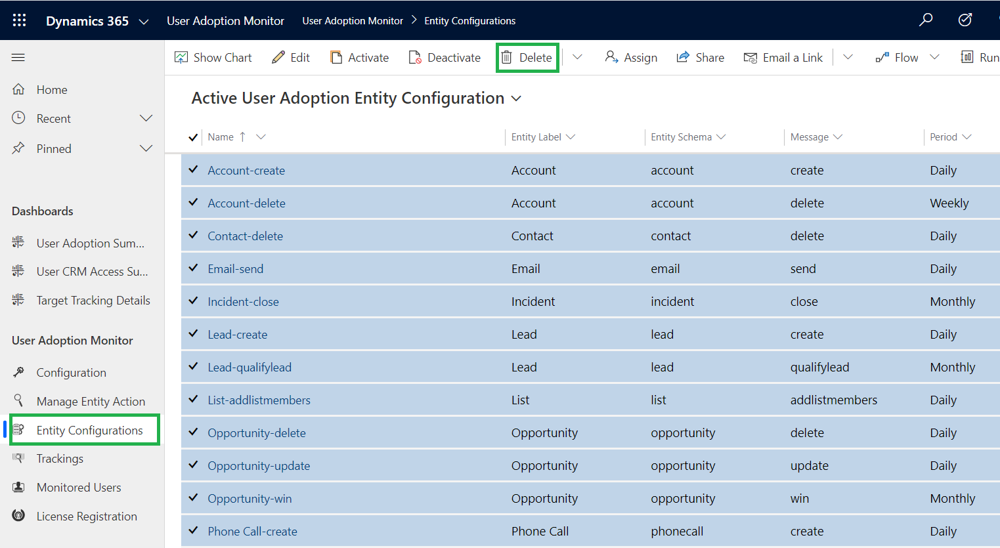
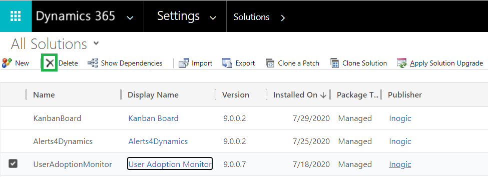

# Uninstallation

If you want to uninstall **User Adoption Monitor**, then first you need to delete Entity Configuration records.

Please follow the below steps to uninstall **User Adoption Monitor** solution from your environment.

1\) Delete all the **User Adoption Monitor** Entity Configuration records. For that navigate to **User Adoption Monitor** App -> Entity Configurations

2\) Navigate to Settings --> Solutions --> Select **User Adoption Monitor** solution.

3\) Click on delete button. A pop-up will appear asking for your confirmation. Click on **OK** and the solution will be uninstalled from your environment.

.png>)
